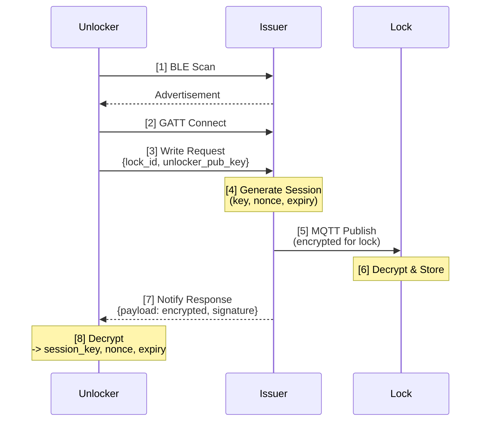
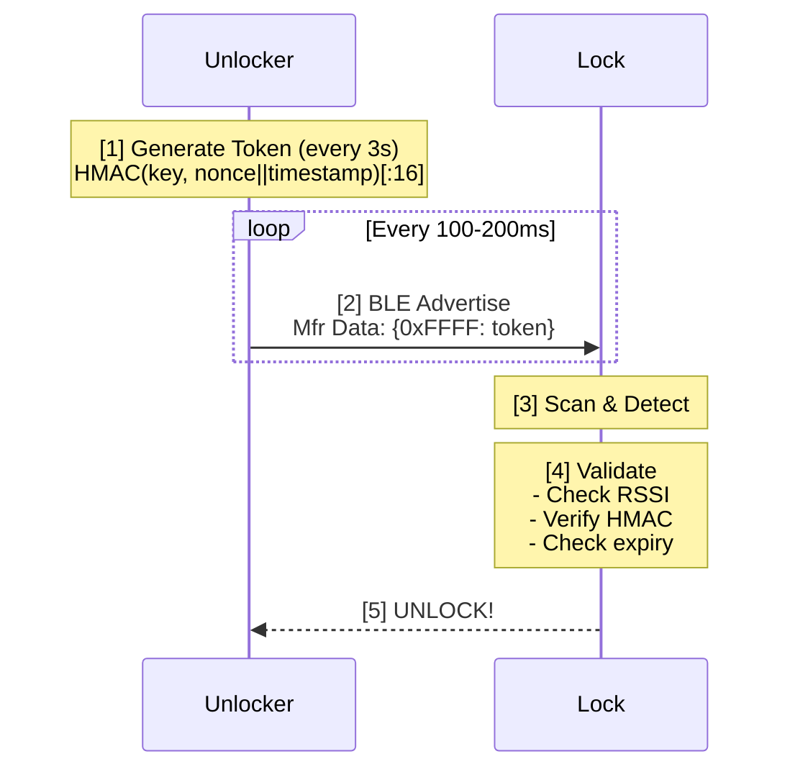

# BLE Locking System

## Overview
A secure BLE locking system where phones obtain short-lived unlock credentials over Bluetooth and present rolling HMAC tokens that locks can verify. The backend issues credentials via BLE GATT, advertises as a provisioning beacon, and distributes encrypted sessions to locks via MQTT.

**Three main components:**

- **Issuer** (`backend/issuer.py`): BLE beacon that provisions sessions and distributes them to locks via MQTT
- **Unlocker** (`guest/unlocker.py`): Guest phone that requests sessions and advertises rolling HMAC tokens
- **Lock** (`lock/lock.py`): Subscribes to MQTT for sessions and validates BLE advertisements to unlock

## Architecture

### Issuer (`backend/issuer.py`)
- Advertises as a BLE beacon for discovery by guest phones
- Exposes GATT characteristic for session provisioning requests
- Generates 32-byte session keys with expiry timestamps and nonces
- Encrypts sessions with RSA-OAEP (using lock's public key) and publishes to MQTT topic `locks/{lock_id}/session`
- Returns encrypted session payload to guest (using guest's public key from request)
- Signs all payloads with RSA-PSS for authenticity

### Unlocker (`guest/unlocker.py`)
- Scans for issuer beacon and connects via BLE GATT
- Sends plaintext request: `{lock_id, client_id, unlocker_public_key}`
- Receives and decrypts session payload using RSA private key
- Generates rolling HMAC-SHA256 tokens every 3 seconds: `HMAC(session_key, nonce||timestamp)`
- Advertises tokens via BLE manufacturer data (company ID `0xFFFF`, 16-byte token)
- Token rotation: every 3s, BLE advertisement: every 100-200ms

### Lock (`lock/lock.py`)
- Subscribes to MQTT topic `locks/{lock_id}/session`
- Decrypts incoming sessions with RSA private key and verifies backend signature
- Scans for BLE advertisements containing manufacturer data
- Validates HMAC tokens against active session(s)
- Unlocks when: token matches + RSSI > -70 dBm + session not expired
- Automatically cleans up expired sessions

## Security Features
- **RSA-2048 encryption**: Session payloads encrypted separately for lock and unlocker
- **RSA-PSS signatures**: All payloads signed by backend for authenticity verification
- **HMAC-SHA256 tokens**: Rolling tokens with nonce + timestamp resist replay attacks
- **Short-lived sessions**: Default 5-minute expiry limits credential lifetime
- **Field-specific encryption**: Only sensitive session data is encrypted (no double-encryption overhead)
- **RSSI proximity check**: Lock only accepts advertisements with signal strength > -70 dBm

## Flow Diagrams

### Session Provisioning


### Lock Unlock



## Prerequisites
- Linux with BLE adapter and BlueZ (with LE Peripheral support)
- Python 3.10+
- MQTT broker (e.g., Mosquitto)

## Installation
```bash
git clone https://github.com/harshsoni-harsh/ble-locking-system.git
cd ble-locking-system
python -m venv .venv
source .venv/bin/activate
pip install -r requirements.txt
```

Start MQTT broker:
```bash
sudo apt install mosquitto
sudo systemctl enable --now mosquitto
```

Generate RSA keys (2048-bit minimum):
- `keys/backend_private.pem` / `backend_public.pem` (issuer)
- `keys/lock_01_private.pem` / `lock_01_public.pem` (per lock)
- `keys/unlocker_private.pem` / `unlocker_public.pem` (per guest)

## Usage

**1. Start Issuer:**
```bash
python -m backend.issuer
```

**2. Start Lock:**
```bash
python -m lock.lock
```

**3. Start Unlocker (guest phone simulator):**
```bash
python -m guest.unlocker
```

The lock will log unlock events when valid tokens are detected.

## Configuration

Key environment variables:
- `LOCK_ID`: Target lock identifier (default: `lock_01`)
- `CLIENT_ID`: Guest client identifier (default: `default`)
- `MQTT_BROKER`: MQTT broker address (default: `localhost`)
- `ISSUER_BEACON_ADDRESS`: Issuer BLE MAC address (optional, for faster discovery)
- `ADVERT_INTERVAL`: Token rotation interval in seconds (default: `3`)

## Debugging Tools
- `bluetoothctl`: Check adapter status and scan for devices
- `sudo btmon`: Monitor raw BLE traffic and advertisement payloads
- `mosquitto_sub -t 'locks/#'`: Monitor MQTT session distribution

## Troubleshooting
- **No issuer found**: Verify beacon is advertising (`sudo btmon`), check `ISSUER_BEACON_ADDRESS`
- **MQTT connection fails**: Confirm broker is running, check firewall/credentials
- **BLE advertisement errors**: Ensure BlueZ runs with `--experimental`, payload ≤ 31 bytes
- **GATT write errors**: Only one process can advertise per adapter; check for conflicts
- **Token validation fails**: Verify clock sync between devices, check `clock_offset` in response

## Future Improvements
- Multi platform app implementation (Android/iOS)
- Session persistence and audit logging
- TLS for MQTT transport
- Distance estimation using calibrated Tx power
